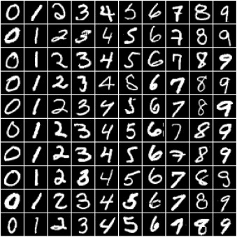

# Deep-Neural-Networks-using-PyTorch

This repository covers the following topics:
- How to create a deep neural network with hidden layers.
- How to use a non-linear activation function.
- How to use a GPU (when available) to speed up training process.
- How to use different hyperparameters to improve the model.

## Preparing the data

The dataset consists of 28*28 grayscale images of handwritten digits (0 to 9) and labels for each image indicating which digit it represents. Here are some sample images from the dataset:

It's quite challenging to improve the accuracy using normal Logistic Regression model which takes linear relationship between inputs and output into account for image classification. So, we will try to improve the accuracy using Feed-Forward Neural Network which can capture non-linear relationship between inputs and targets.

We've prepared the data with step-by-step procedure,
- Import the required libraries.
- Download the data and create a PyTorch dataset.
- We've splitted the dataset into train(50000 images) and validation(10000 images) for validation of the model.
- Created DataLoaders with batch size of 128.

## Hidden Layers, Activation Functions, and Non-Linearity

We've added required number of hidden layers, activation functions to introduce a non-linearity with step-by-step procedures,
- Created a batch of imput tensors and flattened the images of size 1*28*28 into vectors of size 784.
- Added a hidden layer using nn.Linear object with hidden output size(intermediate output vectors) of 32.
- Rectified Linear Unit (ReLU) Function as activation function which converts negative values in a tensor with the value of 0.
- Added output layer to convert vectors into the vetors of length 10, which is the desired output of the model.
- Computed the loss uding cross_entropy to adjust the weights of both hidden and output layer using Gradient Descent.

## Define the Model

- Defined the model by extending the nn.Module class from PyTorch.
- Created a model using Input_Size=784, hidden_size=64, output_size=10.
- Compute the loss on first batch of 128 images from the dataset.
- Leveraged the GPU to train the model.
- Created the DeviceDataLoaders to make use of DataLoaders on a GPU device.

## Training the Model

- Trained the model using fit and evaluate functions with gradient descent.
- Evaluated the performance of the model on validation dataset.

## Testing the model on individual images

- Tested the model with some sample images from predefined 10000 test dataset with same data transformations as used above.

NOTE: We've used a GPU to train the model because when we encounter the larger size of model and datasets we need to train them using reasonable amount of time.
GPU has hundreds of cores optimized for performing expensive matrix operations which makes them ideal for training a deep neural networks.

----------------------------------------------------------

## Technologies Used

- PyTorch
- Python
- Google Colab
- Jupyter Notebook

----------------------------------------------------------

## References

- Dataset: http://yann.lecun.com/exdb/mnist/
- Wiki: https://en.wikipedia.org/wiki/MNIST_database
- PyTorch: https://pytorch.org/docs/stable/index.html

----------------------------------------------------------
